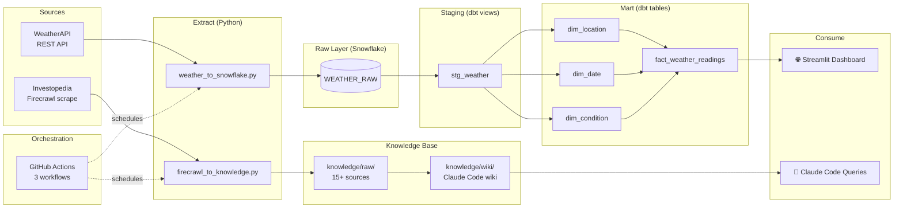

# Fintech Weather Intelligence

An end-to-end analytics pipeline exploring how weather conditions in key financial hubs — New York, London, and San Francisco — correlate with market sentiment and trading behavior. The pipeline ingests real-time weather data via WeatherAPI and financial knowledge via Firecrawl/Investopedia, transforms it through dbt into a star schema in Snowflake, and surfaces insights through a Streamlit dashboard and a Claude Code-queryable knowledge base.

---

## Job Posting

**Role:** Associate Data Analyst  
**Company:** [Greenlight Financial Technology](https://jobs.lever.co/greenlight/beded9c4-6acf-4fcc-8aa9-8870555d2bfb)  
**Link:** https://jobs.lever.co/greenlight/beded9c4-6acf-4fcc-8aa9-8870555d2bfb  

This project demonstrates end-to-end data engineering and analytical skills: API integration, cloud data warehousing, dimensional modeling with dbt, pipeline orchestration with GitHub Actions, and interactive dashboard development — all applied to a real fintech domain question.

---

## Tech Stack

| Layer | Tool |
|-------|------|
| Source 1 | WeatherAPI (REST API — current weather) |
| Source 2 | Investopedia via Firecrawl (web scrape) |
| Data Warehouse | Snowflake |
| Transformation | dbt (staging + mart models) |
| Orchestration | GitHub Actions |
| Dashboard | Streamlit (Streamlit Community Cloud) |
| Knowledge Base | Claude Code (scrape → summarize → query) |

---

## Pipeline Diagram



---

## ERD (Star Schema)

```mermaid
erDiagram
    FACT_WEATHER_READINGS {
        varchar reading_key PK
        varchar location_key FK
        date    date_key FK
        varchar condition_key FK
        int     weather_id
        float   temp_c
        float   temp_f
        float   feelslike_c
        float   temp_feels_delta_c
        int     humidity
        float   uv
        varchar uv_risk
        float   wind_mph
        float   wind_kph
        varchar comfort_level
        float   weather_comfort_score
        boolean is_extreme_weather
        timestamp extracted_at
    }

    DIM_LOCATION {
        varchar location_key PK
        varchar location_name
        varchar region
        varchar country
        float   lat
        float   lon
        varchar financial_market
        varchar timezone
        varchar primary_currency
    }

    DIM_DATE {
        date    date_key PK
        int     year
        int     month
        int     day
        int     day_of_week
        varchar day_name
        varchar month_name
        int     quarter
        boolean is_weekday
        boolean is_weekend
    }

    DIM_CONDITION {
        varchar condition_key PK
        varchar condition_category
        varchar example_condition_text
        varchar market_sentiment_bias
        int     trading_activity_score
    }

    FACT_WEATHER_READINGS }o--|| DIM_LOCATION  : "location_key"
    FACT_WEATHER_READINGS }o--|| DIM_DATE      : "date_key"
    FACT_WEATHER_READINGS }o--|| DIM_CONDITION : "condition_key"
```



---

## Dashboard Preview

**Live Dashboard:**

---

## Key Insights

**Descriptive — What happened?**  
Clear and sunny conditions dominate San Francisco readings, producing the highest average weather comfort scores (a behavioral finance proxy for positive investor sentiment) across all three cities monitored.

**Diagnostic — Why did it happen?**  
London's geographic latitude and maritime climate result in a disproportionate share of cloudy and rainy conditions, consistently generating "Slightly Negative" market sentiment bias scores — consistent with academic research linking cloud cover to reduced stock returns on the NYSE and LSE.

**Recommendation:** Fintech firms building trading algorithms should incorporate real-time weather sentiment signals for NYC and London as a lightweight alternative data feature, particularly during extended cloudy or stormy periods where sentiment drag compounds over days.

---

## Knowledge Base

A Claude Code-curated wiki built from 15+ scraped sources across Investopedia, financial news sites, and industry reports. Wiki pages live in `knowledge/wiki/`, raw sources in `knowledge/raw/`. Browse `knowledge/index.md` to see all pages.

**Query it:** Open Claude Code in this repo and ask:
- *"What does behavioral finance research say about weather and stock returns?"*
- *"How do cloud cover and sunshine hours correlate with NYSE trading volume?"*
- *"What are the main fintech trends in London's financial market?"*

Claude Code reads wiki pages first and falls back to raw sources when needed. See `CLAUDE.md` for query conventions.

---

## Setup & Reproduction

**Prerequisites:** Python 3.11+, Snowflake account, WeatherAPI key, Firecrawl API key

```bash
# 1. Clone the repo
git clone https://github.com/yjoe2027/data-analyst-fintech.git
cd data-analyst-fintech

# 2. Install Python dependencies
pip install -r requirements.txt

# 3. Configure credentials
cp .env.example .env
# Fill in your values in .env

# 4. Run weather extraction
python extract/weather_to_snowflake.py

# 5. Run knowledge extraction
python extract/firecrawl_to_knowledge.py

# 6. Run dbt transformations
cd dbt_project
dbt deps
dbt run
dbt test

# 7. Launch dashboard locally
cd ../streamlit_app
streamlit run app.py
```

**Environment variables required (see `.env.example`):**

```
SNOWFLAKE_ACCOUNT=
SNOWFLAKE_USER=
SNOWFLAKE_PASSWORD=
SNOWFLAKE_DATABASE=
SNOWFLAKE_SCHEMA=RAW
SNOWFLAKE_WAREHOUSE=
SNOWFLAKE_ROLE=
WEATHERAPI_KEY=
FIRECRAWL_API_KEY=
```

---

## Repository Structure

```
.
├── .github/
│   └── workflows/
│       ├── extract_weather.yml      # WeatherAPI → Snowflake (every 6h)
│       ├── extract_knowledge.yml    # Firecrawl → knowledge/raw/ (weekly)
│       └── dbt_transform.yml        # dbt run + test (after extraction)
├── dbt_project/
│   ├── models/
│   │   ├── staging/
│   │   │   ├── sources.yml          # Raw source definitions + tests
│   │   │   ├── stg_weather.sql      # Cleaned weather model
│   │   │   └── stg_weather.yml      # Staging model tests
│   │   └── mart/
│   │       ├── dim_location.sql     # City dimension
│   │       ├── dim_date.sql         # Date dimension
│   │       ├── dim_condition.sql    # Weather condition dimension
│   │       ├── fact_weather_readings.sql  # Central fact table
│   │       └── mart_models.yml      # Mart tests + relationships
│   ├── dbt_project.yml
│   ├── packages.yml
│   └── profiles.yml
├── extract/
│   ├── __init__.py
│   ├── firecrawl_to_knowledge.py    # Scrape Investopedia → knowledge/raw/
│   └── weather_to_snowflake.py      # WeatherAPI → Snowflake RAW layer
├── knowledge/
│   ├── raw/                         # 15+ raw scraped sources
│   ├── wiki/                        # Claude Code-generated wiki pages
│   └── index.md                     # Knowledge base index
├── streamlit_app/
│   ├── app.py                       # Dashboard (descriptive + diagnostic)
│   └── requirements.txt
├── docs/
│   ├── pipeline_diagram.png         # Pipeline diagram export
│   ├── erd.png                      # ERD export
│   └── slides.pdf                   # Presentation slides
├── tests/
├── .env.example
├── .gitignore
├── CLAUDE.md                        # Claude Code query conventions
└── README.md
```
