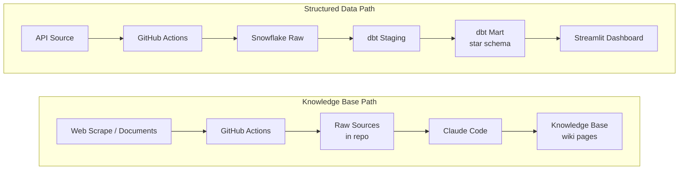

# Portfolio Project: Analytics Engineering

You find a real job posting for a role you'd actually apply to, then build an end-to-end data pipeline and analytics project that demonstrates you can do what the job requires. The project is worth 30% of your course grade and lives in a public GitHub repo you can show to employers.

**This is a portfolio asset, not a one-job artifact.** Design your project so it can transfer to similar roles in the same industry or domain. When you apply to your second, third, or tenth job, you should be able to point at this repo and say "here's what I built to prove I can do this kind of work."

**A core focus of this project is learning to collaborate with AI as a thought partner.** You are expected to use Claude Code, Superpowers, and context engineering throughout the entire workflow, from job search to proposal to implementation to resume refinement. The goal is not just to build a project, but to practice working effectively with AI tools. Every step of this project is an opportunity to get better at directing an AI agent.

## Timeline & Milestones

| Milestone | Due | What's Due |
|---|---|---|
| Proposal | Apr 13 at 9:55 AM | Job posting PDF, one-paragraph reflection, GitHub repo link |
| Milestone 01: Extract, Load & Transform | Apr 27 at 9:55 AM | API source loaded, dbt models, GitHub Actions pipeline, pipeline diagram, Snowflake account |
| Milestone 02: Present & Polish | May 4 at 9:55 AM | Web scrape source loaded, Streamlit dashboard, knowledge base, slides, README, ERD |
| Final Submission | May 11 | Updated resume committed to repo |
| Final Interview | May 11 | Whiteboard walkthrough, project demo |

Your public GitHub repo is your submission. Submit the repo URL to Brightspace by each due date.

## What You're Building

You'll build a pipeline that moves data from two sources into Snowflake, transforms it through raw, staging, and mart layers using dbt, and surfaces it through a Streamlit dashboard, all automated via GitHub Actions. You'll also scrape domain content and use Claude Code to build a knowledge base of synthesized insights.

The **dashboard** answers "how much" and "what happened" using structured data from your star schema.

The **knowledge base** has two layers that work together:

1. **The artifact:** A set of Claude Code-generated wiki pages in your repo that synthesize insights from your scraped sources. The wiki compounds knowledge over time as you add more sources.
2. **The interface:** Claude Code itself. You ask questions like "what does my knowledge base say about X?" and Claude Code reads the wiki pages and raw sources to answer. No deployed chatbot needed. You demo this in your final interview by running Claude Code live against your repo.

Think of the wiki as your database and Claude Code as your query engine. The wiki is portable: you could later plug it into NotebookLM, ChatGPT projects, or any other LLM and it would still work.

## Tech Stack

| Layer | Tool |
|---|---|
| IDE | [Cursor](https://www.cursor.com) |
| AI Development | [Claude Code](https://code.claude.com/docs/en/overview) + [Superpowers](https://github.com/obra/superpowers) |
| Version Control | [Git](https://git-scm.com) + [GitHub](https://github.com) (public repo) |
| Data Warehouse | [Snowflake](https://www.snowflake.com) (trial account, AWS US East 1) |
| Transformation | [dbt](https://www.getdbt.com) |
| Orchestration | [GitHub Actions](https://docs.github.com/en/actions) (scheduled) |
| Dashboard | [Streamlit](https://streamlit.io) (deployed to Streamlit Community Cloud) |
| Knowledge Base | [Claude Code](https://code.claude.com/docs/en/overview) (scrape → summarize → query) |

These are the same tools from the mini-projects. No new setup required.

## Your Job Posting & Data Sources

### Job Posting

Find a real job posting for a role you'd actually apply to. Your project must target the skills that posting lists.

**Hard requirement:** the posting must mention **SQL**. This is an analytics engineering course. If SQL isn't in the posting, it's not the right posting for this project.

**Role titles are examples, not requirements.** Junior analytics engineer, data analyst, data engineer, business intelligence analyst, reporting analyst: any of these work. What matters is that the posting lists skills from this course (SQL, dimensional modeling, dashboards, pipelines, etc.), not the exact job title.

Save the posting as a PDF (`docs/job-posting.pdf`). In your proposal, you'll write a one-paragraph reflection explaining why this posting is relevant to this class and which coursework skills it requires. You'll also reference the posting in your final interview to connect what you built to what the role requires.

### Data Sources

Your pipeline must pull from multiple data sources across these tiers:

- **Required:** An **API** (REST, GraphQL, or a Python client wrapping one). Feeds your structured data pipeline (dbt → dashboard).
- **Required:** A **web scrape or document scrape** (Firecrawl, web scraping APIs, PDFs, company documents, press releases, etc.). Feeds your knowledge base.
- **Optional (no penalty if not applicable):** An **MCP server or CLI connector** for your chosen domain. Only if one is already available for your data source. Don't build one from scratch for this project.

All required sources must be automated via **GitHub Actions on a schedule**.

You'll finalize specific sources as you start Milestone 01. The proposal doesn't require you to name them, but the brainstorming you do with Claude Code should leave you with a short list of plausible candidates.

## Proposal (10 pts) - Due Mon, Apr 13 at 9:55 AM

The proposal is intentionally simple: a job posting, a one-paragraph reflection, and a GitHub repo. Use the [proposal template](proposal-template.md) to create your 1-page proposal. Save it as a markdown file at `docs/proposal.md` in your repo. Save the job posting as `docs/job-posting.pdf`. Submit your repo URL to Brightspace.

| # | Deliverable | Pts | Details |
|---|---|---|---|
| 1 | Job posting PDF | 2 | Saved as `docs/job-posting.pdf`. Must mention SQL. |
| 2 | Proposal markdown with reflection | 5 | 1-page proposal (`docs/proposal.md`) including a one-paragraph reflection on why this posting is relevant to this class and which coursework skills it requires. |
| 3 | GitHub repo initialized | 3 | Public repo with a professional, descriptive name (see below). Proper `.gitignore`, directory structure, `CLAUDE.md` with project context. |

### Repo Naming

Your repo name is the first thing an employer sees. It has to look like something a professional would build.

**Example format:** `[job-title]-[industry]` (e.g., `data-analyst-healthcare`, `analytics-engineer-fintech`, `bi-analyst-retail`)

**Two criteria:**
1. **Professional.** No inside jokes, number chains, or excessive underscores. No `final-project-v2-FINAL`, no `my-cool-project-123`.
2. **Descriptive.** Someone should know what the project is in five seconds just from the name.

You're not limited to the example format. Brainstorm alternatives with Claude Code. The key question: "If a hiring manager saw this repo name on my resume, would they click it?"

**You can rename your repo at any time.** GitHub will set up automatic redirects from the old name to the new one, so any existing links keep working. Don't let perfectionism block you on the proposal. Pick a name you can live with today, and rename it later if you find something better.

## Milestone 01: Extract, Load & Transform (35 pts) - Due Apr 27 at 9:55 AM

API source extracted, loaded to Snowflake, and transformed through dbt. Submit your repo URL to Brightspace.

You'll also need your Snowflake trial account created by this milestone (trial account in AWS US East 1, credentials stored securely via environment variables and never committed to the repo). If you haven't set it up yet, do it in Week 1 of Milestone 01.

| # | Deliverable | Pts | Details |
|---|---|---|---|
| 4 | Source 1 (API) extraction + load to Snowflake raw | 10 | Python script, loads to Snowflake raw schema, env vars for credentials, scheduled via GitHub Actions |
| 5 | dbt project (staging + mart models) | 15 | Star schema in Snowflake: staging models with tests, fact table(s) + dimension table(s) for analysis |
| 6 | GitHub Actions pipeline | 5 | Source 1 automated on a schedule or manual trigger. Graded on pipeline completeness and secrets management. |
| 7 | Data pipeline diagram | 5 | All layers (sources → raw → staging → mart → dashboard + knowledge base), every tool labeled. Open format (Mermaid, draw.io, Excalidraw, etc.). Included in README |

## Milestone 02: Present & Polish (50 pts) - Due May 4 at 9:55 AM

Add your second data source, build the dashboard and knowledge base, and polish everything for your portfolio. Submit your repo URL and slides PDF to Brightspace.

| # | Deliverable | Pts | Details |
|---|---|---|---|
| 8 | Source 2 (web scrape/docs) extraction + load to Snowflake raw | 10 | Different source type from source 1. Scheduled via GitHub Actions. |
| 9 | Streamlit dashboard (deployed) | 15 | Connected to Snowflake mart tables, descriptive + diagnostic analytics, interactive. Public URL |
| 10 | Presentation slides (PDF) | 7 | Descriptive + diagnostic insights, recommendations. Graded on data storytelling principles (see Minimum Requirements). Portfolio artifact, not presented in final interview. Submitted as PDF to Brightspace. |
| 11 | Knowledge base | 8 | Use Claude Code to ingest scraped sources into a `knowledge/` folder. At least 15 raw sources from 3+ different sites/authors in `knowledge/raw/`. Sources can include anything unstructured about your chosen company, industry, or domain: company website, press releases, leadership bios, LinkedIn profiles, earnings call transcripts, research papers, market reports, competitor analysis, regulatory filings. Claude Code-generated wiki pages in `knowledge/wiki/` (overview, key entities, themes), plus an `index.md`. Queryable via Claude Code in your final interview demo. |
| 12 | README.md | 5 | Use the [README template](readme-template.md). Project overview, tech stack, pipeline setup, ERD, pipeline diagram, insights summary |
| 13 | ERD (star schema) | 3 | Generated by Claude Code from dbt models. Fact + dimension tables. Included in README |
| 14 | Commit history + repo structure | 2 | Frequent meaningful commits, clean directory structure |

## Final Submission (5 pts) - Due May 11

Your final submission is an updated resume, committed to your repo as `docs/resume.pdf`. This happens alongside your final interview. It's the last artifact that ties the project to your job search.

| # | Deliverable | Pts | Details |
|---|---|---|---|
| 15 | Updated resume (PDF) | 5 | Saved as `docs/resume.pdf`. Must include (1) skills you learned in this class, (2) a Projects section featuring this capstone with 2-3 bullets on what you built and why it matters, (3) tailoring to the original job posting you proposed. Use Claude Code to draft and refine your resume language. |

**Total: 100 points (30% of course grade)**

## Grading

Meeting all minimum requirements earns a B-range grade. An A requires going beyond the minimums with depth, polish, and analytical insight.

| Grade | Description |
|---|---|
| A | Exceeds minimums with depth, polish, and insight. An employer would be impressed by this repo. |
| B | Meets all minimums solidly. Functional and complete but doesn't go beyond. |
| C | Meets most minimums but has gaps: missing tests, shallow analysis, broken deployment. |
| D | Significant gaps: incomplete pipeline, no deployment, minimal effort. |
| F | Not submitted or fundamentally incomplete. |

### Minimum Requirements

Full checklists for the four highest-stakes deliverables. Other deliverables are graded against the descriptions in the milestone tables above.

#### dbt Project (15 pts)

- At least one staging model per source (cleaning, renaming, type casting)
- At least one fact table and at least one dimension table
- Star schema design with relationships between fact and dimension tables
- At least one dbt test passing
- `dbt run` and `dbt test` execute without errors
- Models materialized in Snowflake

#### Streamlit Dashboard (15 pts)

- Connected to Snowflake mart tables
- At least one descriptive analytics view (what happened?)
- At least one diagnostic analytics view (why did it happen?)
- At least one interactive element (filter, selector, or tab)
- Deployed to Streamlit Community Cloud with public URL

#### Knowledge Base (8 pts)

- At least 15 scraped sources in `knowledge/raw/` from at least 3 different sites or authors
- Sources can include anything unstructured about your chosen company, industry, or domain (company website, press releases, leadership bios, LinkedIn profiles, earnings calls, research papers, market reports, competitor analysis, regulatory filings, etc.)
- Claude Code-generated wiki pages in `knowledge/wiki/` (at least 3 pages: overview, key entities or themes, and one synthesis page)
- `knowledge/index.md` listing all wiki pages with one-line summaries
- Wiki pages show synthesis across multiple sources, not just individual summaries
- Evidence of iterative use: sources were ingested and wiki pages were updated over time (visible in commit history)
- `CLAUDE.md` includes a section explaining how to query the knowledge base (the conventions Claude Code should follow when answering questions about it)
- Demoable: in your final interview, you can run Claude Code against your repo and ask it a question that pulls from your wiki pages

#### Presentation Slides (7 pts)

- At least one descriptive analytics insight with Takeaway Title and supporting visual
- At least one diagnostic analytics insight with Takeaway Title and supporting visual
- Callout on each visual that highlights the key evidence
- Actionable recommendation: [Action] → [Expected outcome]
- Designed as a portfolio artifact, ready to use in a real job interview

**Data Storytelling Principles (Lesson 05 refresher):**

- **Takeaway Titles:** State the insight, not the category. "Email delivers 9x more conversions per dollar" not "Marketing Channel Performance." If someone reads only the title, they should know what happened.
- **Callouts:** Circle, arrow, or highlight that draws the eye to the key evidence in the visual.
- **Recommendation format:** [Action] → [Expected outcome]. Specific and actionable. "Shift 40% of display budget to email → projected 200+ additional conversions" not "improve marketing."

### Quality Rubric

Beyond the minimums, grading rewards quality across these themes:

**Analytical depth:** Are the business questions interesting and relevant to the job posting? Does the diagnostic analysis dig into root causes, or just show another chart? Are the recommendations actionable and specific?

**Technical quality:** Is the star schema well-designed? Are dbt models clean and tested? Is the pipeline reliable and well-organized? Is the code documented?

**Polish and UX:** Is the dashboard layout thoughtful (labels, color, flow)? Does the knowledge base surface genuine insights from the scraped sources? Are the slides visually clear and story-driven? Would you demo this confidently in a job interview?

**Documentation:** Does the README explain the project clearly to someone seeing it for the first time? Is the pipeline diagram accurate and complete? Does the ERD match the actual dbt models?

## Getting Started

No example projects are provided. Use Claude Code with the Superpowers brainstorming skill to develop your project idea. **This is also your first real practice with context engineering:** stacking the right context so the LLM gives you good output.

### Context Engineering for Proposal Brainstorming

When you open Claude Code and ask it to help you brainstorm, layer in context progressively:

1. **Project requirements.** Paste or reference this `project/README.md` file. Claude Code needs to know the constraints (SQL must be in the posting, API + scrape required, knowledge base pattern, transferability).
2. **Class repo context.** Point Claude Code at the `lessons/` folder so it knows what skills you've actually covered. It can then match posting requirements against your real skill set instead of guessing.
3. **Job posting.** Once you find one, reference it by file path, screenshot, or copy-paste.
4. **Resume (optional).** If you have relevant experience, paste your current resume so Claude Code can reason about skill gaps and transferability. **If your resume is limiting you** (little work experience, no relevant projects yet), skip this and search by interest, domain, or problem-type instead. Your interest is better context than a thin resume.

### Brainstorming Flow

1. Find and save your job posting as a PDF. **Must mention SQL.**
2. Open Claude Code and invoke the Superpowers brainstorming skill. Layer in context from the list above.
3. Explore: What skills does the role require? Which coursework skills overlap? What data would prove you can do this work? What other roles would this project transfer to?
4. Draft your one-paragraph reflection with Claude Code's help, then edit it yourself.
5. Name your repo (see Repo Naming above), initialize it, and commit `docs/proposal.md` + `docs/job-posting.pdf`.

**Transferability prompt to use during brainstorming:** "If I built this project, what 2-3 other roles in the same industry or domain could I use it for? What small changes would make it even more reusable across those roles?"

Your proposal locks in the job posting and project framing, but data sources are finalized during Milestone 01 as you learn more in Mini-Projects 02-04.

## Policies

- **Individual project.** All work must be your own.
- **Late penalty.** 10% deduction per day late.
- **AI usage.** Claude Code is your primary development tool. You are expected and encouraged to use it for scaffolding, debugging, and building. But you must be able to explain every component in your final interview. If you can't explain it, you don't get credit for it.
- **Public repo.** This is a portfolio piece. Employers will see it.
- **No credentials in the repo.** Use `.env` files and `.gitignore`. Environment variables for all secrets. No database passwords, API keys, or Snowflake credentials committed to git.
